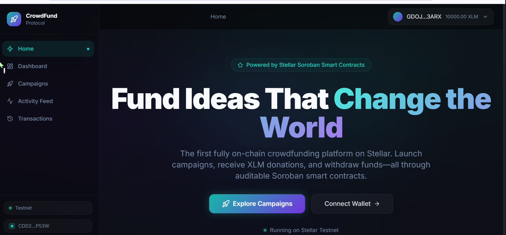
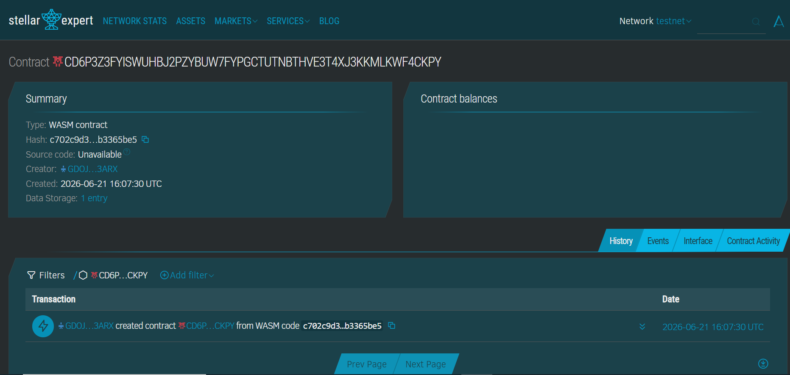

# 🚀 CrowdFund Protocol

A **production-ready**, end-to-end decentralized crowdfunding dApp built with Next.js and **Soroban Smart Contracts** on the **Stellar Testnet**. The platform enables anyone to launch on-chain fundraising campaigns, receive XLM donations, and automatically earn **CRWD reward tokens** through inter-contract minting — all governed transparently by Soroban smart contracts.

🌐 **Live Deployment**: [https://crowdfunding-protocol.vercel.app/](https://crowdfunding-protocol.vercel.app/)

---

## 📸 Screenshots

> Connect your Freighter wallet, browse campaigns, view CRWD reward balance, and track live on-chain activity — all from one premium dark-mode dashboard.

| Dashboard | Stellar Expert Explorer |
|---|---|
|  |  |

---

## 🔗 Contract Explorer & Credentials

| Resource | Value / Link |
|---|---|
| **CrowdFund Contract ID** | `CD5NOBNCWJTADXQ3KSD7PPZ3Q6LXRPILESX5DYZPWDF3IRNFN4NC5UZZ` |
| **Reward Token Contract ID** | `CALO2WLBSYWRIVAMN6K2AWY2QLCOB35CZK4TNR7JLOUL4FKSVRWASQ3J` |
| **Stellar Expert Explorer** | [View Contract on Stellar Expert](https://stellar.expert/explorer/testnet/contract/CD5NOBNCWJTADXQ3KSD7PPZ3Q6LXRPILESX5DYZPWDF3IRNFN4NC5UZZ) |
| **Deployer Wallet Address** | `GD72NER3ZO4YDKP6Y5JOVMUASYODC5WQ3VNFEWJA2XHRXKYCVUSJOLHA` |
| **Network** | Stellar Testnet |
| **RPC URL** | `https://soroban-testnet.stellar.org` |
| **Horizon URL** | `https://horizon-testnet.stellar.org` |

---

## 🏆 Level 3 Requirements — How They Are Met

This section maps every Level 3 requirement to the concrete implementation in this repository.

| # | Requirement | Implementation |
|---|---|---|
| 1 | Advanced smart contract development | Two independent Soroban contracts with error handling, paginated queries, deadline management, campaign lifecycle state machine |
| 2 | Inter-contract communication | `CrowdfundContract` calls `RewardTokenContract::mint` on every donation via a generated `contractclient` |
| 3 | Event streaming & real-time updates | 5-second Soroban RPC `getEvents` polling, animated countdown UI, live filter pills with counts |
| 4 | CI/CD pipeline setup | GitHub Actions with 3 jobs: Rust clippy + tests + WASM build, Vitest + Next.js build, cargo-audit + npm audit |
| 5 | Smart contract deployment workflow | Automated `deploy.js` script: compiles, funds, uploads, deploys, initializes, links, updates `.env.local` + README |
| 6 | Mobile responsive frontend | Tailwind `sm:` / `lg:` responsive grid for balance cards, campaign grid, event feed and forms |
| 7 | Error handling & loading states | `Loader2` spinners, disabled states on all async buttons, `AlertCircle` error banners, Sonner toast notifications, contract error decoding |
| 8 | Writing tests for contracts and frontend | 8 Rust contract tests + 5 reward token tests; 10 Vitest component tests + 8 dashboard page tests = **31 tests total** |
| 9 | Production-ready architecture | Zustand stores, React Query, `simulateReadCall` isolation, `assembleTransaction`, server-external packages, TypeScript strict types |
| 10 | Documentation & demo presentation | This README with full architecture, function tables, CI badge, deployment walkthrough, and user flow guide |

---

## ✨ Features

- 🎯 **Campaign Creation**: Any connected wallet can launch a crowdfunding campaign with a goal (in XLM), deadline, title, and description — all recorded on-chain.
- 💸 **XLM Donations**: Donors can contribute XLM to any active campaign directly through Soroban smart contract invocations.
- 🪙 **CRWD Reward Tokens**: Every donation triggers an inter-contract `mint` call, awarding the donor `CRWD` tokens at a 1:1 ratio (1 CRWD per 1 XLM donated).
- 🔒 **Trustless Fund Release**: Campaign creators can only withdraw funds after the goal is met AND the deadline has passed — enforced by the contract.
- 🔄 **Automatic Refunds**: If a campaign expires without reaching its goal, donors can claim a full refund from the smart contract.
- 🔔 **Live Event Feed with Filters**: 5-second polling of the Soroban `getEvents` endpoint, with animated countdown, activity filter pills, and live connectivity pulse.
- 💼 **Multi-Wallet Integration**: Full wallet selection modal using `StellarWalletsKit`, supporting Freighter, xBull, Albedo, Rabet, and more.
- 📊 **Real-Time Progress Bars**: Campaign funding progress calculated live from on-chain data with animated bars.
- 📱 **Mobile Responsive**: Tailwind CSS responsive grids (`sm:grid-cols-2 lg:grid-cols-3`) across all pages.
- 🛡️ **Error Handling**: Every async action has loading spinners, disabled button states, try/catch error banners, and decoded contract error messages.
- 🌗 **Dark Glassmorphism UI**: Premium dark-mode interface with glassmorphic cards, gradient text, micro-animations, and neon glow effects.

---

## ⚙️ Tech Stack & Architecture

| Layer | Technology |
|---|---|
| **Frontend Framework** | Next.js 16 (App Router) |
| **Styling & Theme** | Tailwind CSS v3 (custom dark glassmorphism design system) |
| **State Management** | Zustand (wallet, transactions, and events stores) |
| **Data Fetching** | TanStack Query / React Query v5 |
| **Blockchain Connectivity** | `@stellar/stellar-sdk` v13 & `@creit.tech/stellar-wallets-kit` |
| **Smart Contracts** | Soroban Rust SDK v22 — compiled to `wasm32-unknown-unknown` |
| **UI Primitives** | Radix UI (dialogs, selects, progress, tabs, tooltips) |
| **Animations** | Framer Motion |
| **Notifications** | Sonner (toast system) |
| **Testing (Frontend)** | Vitest v4 + React Testing Library + jsdom |
| **Testing (Contracts)** | Soroban test harness (`mock_all_auths`, `register_contract`) |
| **CI/CD** | GitHub Actions (3 parallel jobs) |

---

## 📂 Project Structure

```
crowdfunding-protocol/
├── .github/
│   └── workflows/
│       └── ci.yml              # CI/CD: contract tests, frontend tests, security audit
│
├── app/
│   ├── layout.tsx              # Root layout, providers, metadata, global fonts
│   ├── page.tsx                # Landing page — hero, stats, feature cards, CTA
│   ├── campaigns/
│   │   ├── page.tsx            # Campaign grid with search, filter, and create modal
│   │   └── [id]/page.tsx       # Campaign detail — donate, withdraw, refund, donors
│   ├── dashboard/
│   │   ├── page.tsx            # Wallet dashboard: XLM + CRWD reward balance cards
│   │   └── __tests__/
│   │       └── page.test.tsx   # 8 Vitest unit tests for dashboard page
│   ├── activity/               # Live on-chain event feed (5s polling + filters)
│   └── transactions/           # Personal transaction history log
│
├── components/
│   ├── layout/
│   │   ├── Navbar.tsx          # Top navigation bar with breadcrumb & wallet status
│   │   └── Sidebar.tsx         # Fixed left sidebar with nav links & network badge
│   ├── wallet/
│   │   └── WalletConnect.tsx   # Connect/disconnect button & wallet info display
│   ├── campaigns/
│   │   ├── CampaignCard.tsx    # Campaign card with progress, deadline, status badge
│   │   └── __tests__/
│   │       └── CampaignCard.test.tsx  # 10 Vitest unit tests for CampaignCard
│   └── activity/
│       └── EventFeed.tsx       # Live event feed with filter pills & countdown timer
│
├── contracts/
│   ├── crowdfund/              # Main crowdfunding Soroban contract
│   │   └── src/
│   │       ├── lib.rs          # Campaign lifecycle, inter-contract mint on donate
│   │       ├── types.rs        # Campaign, Donation, DataKey, CampaignStatus types
│   │       ├── events.rs       # On-chain event emission helpers
│   │       ├── storage.rs      # Storage TTL helpers
│   │       └── error.rs        # Contract error codes
│   └── reward_token/           # CRWD reward token Soroban contract
│       └── src/
│           └── lib.rs          # Mintable fungible token with admin-only minting
│
├── hooks/
│   ├── useCampaigns.ts         # useQuery + useMutation for all campaign operations
│   ├── useEvents.ts            # 5-second polling hook for Soroban contract events
│   └── useWallet.ts            # Wallet connection, XLM + CRWD reward balance
│
├── lib/
│   ├── stellar/
│   │   ├── contract.ts         # Soroban RPC calls, simulateReadCall, fetchRewardBalance
│   │   ├── wallet-kit.ts       # StellarWalletsKit initialization & signing
│   │   └── config.ts           # Network config, RPC URLs, contractId, rewardTokenId
│   └── utils.ts                # Class merging, XLM ↔ stroops converters, formatters
│
├── scripts/
│   └── deploy.js               # Auto-deploy: build, fund, deploy both contracts, initialize, link
│
├── store/
│   ├── wallet-store.ts         # Zustand wallet state (address, balance, rewardBalance)
│   ├── transaction-store.ts    # Zustand tx history (pending, success, failed)
│   └── event-store.ts          # Zustand event feed cache
│
├── types/
│   └── index.ts                # Campaign, Donation, ContractEvent, StellarConfig types
│
├── vitest.config.ts            # Vitest test configuration (jsdom, React plugin, aliases)
├── vitest.setup.ts             # Jest-DOM matchers setup
└── .github/workflows/ci.yml    # GitHub Actions CI/CD pipeline
```

---

## 🚀 Setup & Local Execution

### Prerequisites

- **Node.js** v18 or higher
- **Rust** with `wasm32-unknown-unknown` target *(for contract compilation)*
- **Freighter** browser extension configured for **Testnet** (or any Stellar-compatible wallet)

---

### 1. Clone the Repository

```bash
git clone https://github.com/your-username/crowdfunding-protocol.git
cd crowdfunding-protocol
```

### 2. Install Dependencies

```bash
npm install
```

### 3. Configure Environment Variables

Create or verify the `.env.local` file at the project root:

```env
NEXT_PUBLIC_STELLAR_NETWORK=testnet
NEXT_PUBLIC_STELLAR_RPC_URL=https://soroban-testnet.stellar.org
NEXT_PUBLIC_NETWORK_PASSPHRASE="Test SDF Network ; September 2015"
NEXT_PUBLIC_CROWDFUND_CONTRACT_ID=CD5NOBNCWJTADXQ3KSD7PPZ3Q6LXRPILESX5DYZPWDF3IRNFN4NC5UZZ
NEXT_PUBLIC_REWARD_TOKEN_CONTRACT_ID=CALO2WLBSYWRIVAMN6K2AWY2QLCOB35CZK4TNR7JLOUL4FKSVRWASQ3J
NEXT_PUBLIC_HORIZON_URL=https://horizon-testnet.stellar.org
NEXT_PUBLIC_DEPLOYER_ADDRESS=GD72NER3ZO4YDKP6Y5JOVMUASYODC5WQ3VNFEWJA2XHRXKYCVUSJOLHA
NEXT_PUBLIC_NATIVE_TOKEN_ADDRESS=CDLZFC3SYJYDZT7K67VZ75HPJVIEUVNIXF47ZG2FB2RMQQVU2HHGCYSC
```

> **Note:** If `NEXT_PUBLIC_CROWDFUND_CONTRACT_ID` is left empty, the app falls back to built-in mock campaign data for UI exploration without a live contract.

### 4. Run Development Server

```bash
npm run dev
```

Open [http://localhost:3000](http://localhost:3000) to view the application.

> **Windows Users:** If `npm` is blocked by PowerShell's execution policy, run:
> ```powershell
> Set-ExecutionPolicy -ExecutionPolicy RemoteSigned -Scope CurrentUser
> ```

### 5. Build for Production

```bash
npm run build
npm run start
```

---

## 🧪 Testing

### Smart Contract Tests (Rust)

```bash
# Run all contract tests in the workspace (crowdfund + reward_token)
cargo test --workspace
```

**Results:** 13 tests pass (8 crowdfund + 5 reward_token):
```
running 8 tests in crowdfund
test test::test_initialize                       ... ok
test test::test_double_initialize_fails          ... ok
test test::test_create_campaign                  ... ok
test test::test_create_campaign_invalid_goal_fails ... ok
test test::test_set_reward_token                 ... ok
test test::test_set_reward_token_unauthorized_fails ... ok
test test::test_get_campaigns_paginated          ... ok
test test::test_extend_deadline                  ... ok
test result: ok. 8 passed; 0 failed

running 5 tests in reward_token
test test::test_initialize_and_metadata          ... ok
test test::test_mint_increases_balance           ... ok
test test::test_transfer_tokens                  ... ok
test test::test_double_initialize_fails          ... ok
test test::test_transfer_insufficient_balance_fails ... ok
test result: ok. 5 passed; 0 failed
```

### Frontend Tests (Vitest + React Testing Library)

```bash
# Run all frontend unit tests
npm run test

# Watch mode
npm run test:watch

# Coverage report
npm run test:coverage
```

**Results:** 18 tests pass across 2 test files:
```
✓ components/campaigns/__tests__/CampaignCard.test.tsx  (10 tests)
✓ app/dashboard/__tests__/page.test.tsx                 (8 tests)

Test Files  2 passed (2)
     Tests  18 passed (18)
```

---

## 🔁 CI/CD Pipeline

The GitHub Actions workflow (`.github/workflows/ci.yml`) runs automatically on every `push` to `main`/`develop` and on all `pull_request` events targeting `main`.

```
┌─────────────────────────────┐   ┌─────────────────────────────┐   ┌─────────────────────────────┐
│  🦀 Smart Contract Tests    │   │  🌐 Frontend Tests & Build  │   │  🔐 Security Audit          │
│                             │   │                             │   │                             │
│  • Rust stable toolchain    │   │  • Node.js 20               │   │  • cargo-audit              │
│  • cargo clippy -D warnings │   │  • npm ci (clean install)   │   │  • npm audit --audit-level  │
│  • cargo test --workspace   │   │  • npm run lint             │   │    =high                    │
│  • WASM release build       │   │  • npm run test (Vitest)    │   │                             │
│  • Upload WASM artifacts    │   │  • npm run build            │   │  (continue-on-error: true)  │
└─────────────────────────────┘   └─────────────────────────────┘   └─────────────────────────────┘
```

---

## 🏗️ Smart Contract — Inter-Contract Communication

### Architecture Overview

```
User Wallet
    │
    │ donate(campaign_id, donor, amount)
    ▼
┌───────────────────────────────┐
│     CrowdFund Contract        │
│  CD5NOBNCWJTADXQ3KSD7PPZ...   │
│                               │
│  1. Accept XLM donation       │
│  2. Update campaign.raised    │
│  3. Emit donation_made event  │
│  4. ─── cross-contract ──▶    │  mint(donor, amount)
└───────────────────────────────┘
                │
                ▼
┌───────────────────────────────┐
│     RewardToken Contract      │
│  CALO2WLBSYWRIVAMN6K2AWY2...  │
│                               │
│  • Admin = CrowdFund contract │
│  • Mints CRWD tokens to donor │
│  • 1 CRWD per 1 XLM donated  │
└───────────────────────────────┘
```

### CrowdFund Contract Functions

| Function | Parameters | Description |
|---|---|---|
| `initialize` | `admin: Address` | Initialize contract, set admin |
| `set_reward_token` | `admin, token_address` | Admin-only: link reward token contract |
| `get_reward_token` | *(none)* | Returns stored reward token address |
| `create_campaign` | `creator, title, description, goal, deadline` | Creates a new on-chain campaign |
| `donate` | `campaign_id, donor, amount` | Donates XLM and triggers CRWD mint |
| `withdraw` | `campaign_id, creator` | Withdraws funds from a successful campaign |
| `refund` | `campaign_id, donor` | Claims refund from an expired campaign |
| `extend_deadline` | `campaign_id, creator, new_deadline` | Extends deadline of an active campaign |
| `get_campaign` | `id` | Returns a single campaign by ID |
| `get_campaigns` | `start_id, limit` | Returns a paginated list of campaigns |
| `get_donations` | `campaign_id` | Returns all donations for a campaign |
| `get_campaign_count` | *(none)* | Returns total campaign count |
| `get_admin` | *(none)* | Returns current admin address |

### RewardToken Contract Functions

| Function | Parameters | Description |
|---|---|---|
| `initialize` | `admin, name, symbol` | Initialize token (admin = CrowdFund contract) |
| `mint` | `to, amount` | Admin-only: mint CRWD tokens to a recipient |
| `transfer` | `from, to, amount` | Transfer CRWD tokens between addresses |
| `balance_of` | `owner` | Returns CRWD balance of an address |
| `name` | *(none)* | Returns token name ("CrowdFund Reward") |
| `symbol` | *(none)* | Returns token symbol ("CRWD") |
| `admin` | *(none)* | Returns admin address (CrowdFund contract) |

### Campaign Status States

| Status | Condition |
|---|---|
| `Active` | Deadline not reached, goal not yet met |
| `Successful` | Goal amount reached (withdrawal unlocked) |
| `Expired` | Deadline passed without reaching goal (refunds unlocked) |
| `Withdrawn` | Creator has successfully withdrawn the funds |

---

## 📦 Smart Contract Deployment Workflow

The deployment is fully automated via the `npm run deploy:contract` script. It handles the entire lifecycle in one command:

```bash
npm run deploy:contract
```

**What it does, step-by-step:**

1. **Compile** — runs `cargo build --target wasm32-unknown-unknown --release` on the full workspace.
2. **Fund** — generates a fresh deployer keypair and funds it via Stellar Friendbot.
3. **Upload & Deploy RewardToken** — uploads `reward_token.wasm`, creates a contract instance (salt = `0x01`).
4. **Upload & Deploy CrowdFund** — uploads `crowdfund.wasm`, creates a contract instance (salt = `0x00`).
5. **Initialize CrowdFund** — calls `initialize(deployer)` to set the deployer as admin.
6. **Initialize RewardToken** — calls `initialize(crowdfund_id, "CrowdFund Reward", "CRWD")`, setting the Crowdfund contract as the exclusive mint authority.
7. **Link contracts** — calls `set_reward_token(admin, reward_token_id)` on the CrowdFund contract.
8. **Update config** — writes both contract IDs and deployer address to `.env.local` and `README.md` automatically.

**Latest deployment on Stellar Testnet:**
```
CROWDFUND CONTRACT ID  : CD5NOBNCWJTADXQ3KSD7PPZ3Q6LXRPILESX5DYZPWDF3IRNFN4NC5UZZ
REWARD TOKEN ID        : CALO2WLBSYWRIVAMN6K2AWY2QLCOB35CZK4TNR7JLOUL4FKSVRWASQ3J
DEPLOYER ADDRESS       : GD72NER3ZO4YDKP6Y5JOVMUASYODC5WQ3VNFEWJA2XHRXKYCVUSJOLHA
```

---

## 🔄 Core User Flow

1. **Connect Wallet** — Click **Connect Wallet** and select your Stellar wallet (Freighter recommended). The app reads your XLM and CRWD reward balances in parallel.
2. **Browse Campaigns** — Navigate to `/campaigns` to view all active, successful, and expired campaigns fetched live from the Soroban contract.
3. **Create a Campaign** — Click **+ New Campaign**, fill in the title, description, funding goal (XLM), and duration. Sign the Soroban transaction in your wallet.
4. **Donate to a Campaign** — Open any active campaign, enter an XLM amount, and click **Donate**. The contract holds the funds in escrow and mints you CRWD reward tokens (1 CRWD per 1 XLM).
5. **View CRWD Balance** — Open `/dashboard` to see your earned CRWD reward tokens in the violet reward card.
6. **Withdraw Funds** — If you are the campaign creator and the goal was met, click **Withdraw** to release the funds to your wallet.
7. **Claim Refund** — If a campaign expired without reaching its goal, donors can click **Claim Refund** to recover their XLM.
8. **Monitor Activity** — Visit `/activity` to view a live event stream with filter pills and a countdown timer for the next 5-second poll.
9. **Transaction History** — Visit `/transactions` for a personal log of every transaction you have submitted.

---

## 🧩 On-Chain Events

The contract emits the following events captured by the live activity feed:

| Event Type | Trigger |
|---|---|
| `campaign_created` | A new campaign is successfully created |
| `donation_made` | A donor contributes XLM to a campaign (+ CRWD minted) |
| `funds_withdrawn` | A creator withdraws from a successful campaign |
| `refund_issued` | A donor receives a refund from an expired campaign |

---

## 🌐 Wallet Support

Powered by [`@creit.tech/stellar-wallets-kit`](https://github.com/Creit-Tech/Stellar-Wallets-Kit):

- 🟠 **Freighter** *(recommended)*
- 🔵 **xBull**
- ⚪ **Albedo**
- 🟣 **Rabet**
- 🟤 **WalletConnect**

---

## 🛠️ Error Handling & Loading States

The app gracefully handles the following wallet and contract errors with full loading states:

| Error | UX Response |
|---|---|
| Wallet not installed | Toast: "Please install [WalletName] to continue" |
| User rejected transaction | Toast: "Transaction was cancelled" |
| Insufficient XLM balance | Toast: "Insufficient balance for this transaction" |
| Contract simulation failed | Displays the decoded Soroban error message |
| Transaction timed out | Toast: "Transaction timed out after 30 seconds" |
| Network connection error | `AlertCircle` banner with error message on dashboard |
| Invalid campaign input | Inline validation with field-level error messages |

Every async button shows a `Loader2` spinning icon and is `disabled` during processing to prevent double-submissions.

---

## 📄 License

MIT License — free to use, fork, and build upon.

---

*Built on the Stellar blockchain with ❤️ using Soroban smart contracts — Level 3 Production-Ready dApp.*
